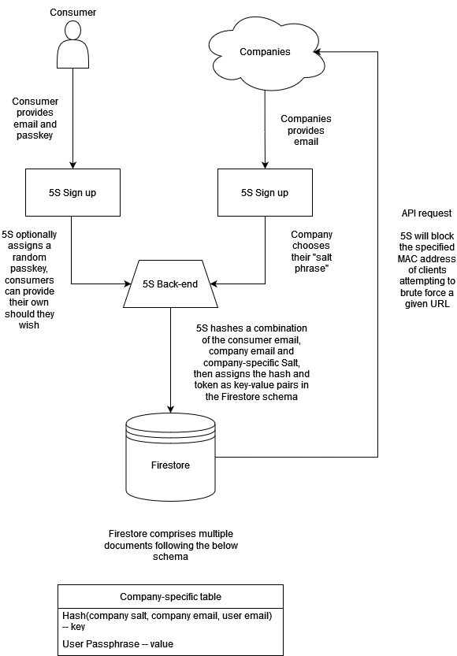

# `five-seconds` -- A Cryptographic, Encrypted One-way Passphrase Implementation.

Created for the purposes of `>4.0GPA`'s solution [*YouthxHack 2024 Hackathon*](https://www.cyberyouth.sg/events/youthxhack-2024-total-defence-edition).  
  
Solution satisfies the Digital Defences problem statement.

## Members

* [Keylani K. Dylovan](https://www.linkedin.com/in/kkdylovan/)
* [Gabriel Ong Z. M.](https://www.linkedin.com/in/gabriel-zmong/)
* [Tay W. L., Astin](https://www.linkedin.com/in/astintay/)
* [Nichole Bun W. X.](https://www.linkedin.com/in/nicholebun/)
* [Bethel Loke H. T.](https://www.linkedin.com/in/bethloke/)

## Setup

> [!IMPORTANT]
> You will require an existing [Google Cloud](https://cloud.google.com/) paid Firebase account and the main Google Cloud CLI.

Please place your Firestore `.json` file at the top level of the tree structure.

```console
$ pip install -r requirements.txt
$ flask --app ./src/main run # execute the program
```

## Architecture



## Others

* View the Figma [here](https://www.figma.com/design/XzFdS140osFXyViaS5b4UQ/5seconds?node-id=4-4&t=WruDP8313mYz1D5T-1)
* For full disclosure, parts of this codebase relied on ChatGPT 4o
